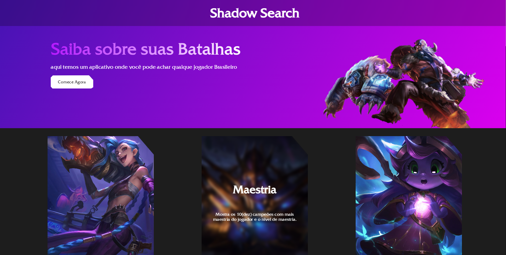

## Shadow Search 
Este é um projeto Angular para exibir informações de jogadores de League of Legends.




## Funcionalidades
Permite pesquisar um jogador pelo nome de usuário.
Exibe os principais campeões e estatísticas do jogador.
Mostra as partidas recentes do jogador.


## Pré-requisitos
Certifique-se de ter o seguinte instalado em seu ambiente de desenvolvimento:

Node.js (versão 12 ou superior)
Angular CLI


## Instalação
Siga as instruções abaixo para configurar e executar o projeto:

Clone este repositório para o seu computador:

```
git clone https://github.com/seu-usuario/projeto-jogador.git

```


Navegue até o diretório do projeto:


```
cd projeto-jogador

```


Instale as dependências do projeto:

```
npm install

```


Inicie o servidor de desenvolvimento:

```
ng serve

```


Abra o navegador e acesse http://localhost:4200 para ver o projeto em execução.

## Configuração
Antes de executar o projeto, você precisará configurar as chaves de API necessárias. Siga as etapas abaixo:

Renomeie o arquivo src/environments/environment.example.ts para src/environments/environment.ts.

Abra o arquivo src/environments/environment.ts e insira suas chaves de API nos campos apropriados.

## API Utilizadas
Este projeto faz uso das seguintes APIs:

API de Jogadores: https://br1.api.riotgames.com/lol/summoner/v4/summoners/by-name/playername?api_key=apikey

API da maestria com campeoes: https://br1.api.riotgames.com/lol/champion-mastery/v4/champion-masteries/by-summoner/playerid?api_key=apikey

API do ID das partidas: https://americas.api.riotgames.com/lol/match/v5/matches/by-puuid/playerPuuid/ids?start=0&count=20&api_key=apikey

API onde pega informação da partida: https://americas.api.riotgames.com/lol/match/v5/matches/matchIdapi_key=apikey

API do rank do jogador: https://br1.api.riotgames.com/lol/league/v4/entries/by-summoner/summonerId?api_key=apikey


Certifique-se de obter suas chaves de API válidas para usar neste projeto.

## Contribuição
Contribuições são bem-vindas! Se você tiver sugestões, correções de bugs ou melhorias para o projeto, sinta-se à vontade para abrir uma issue ou enviar um pull request.
